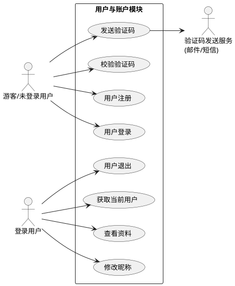
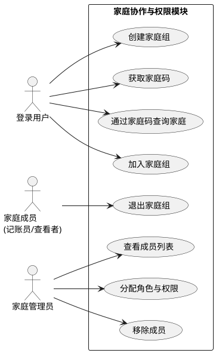
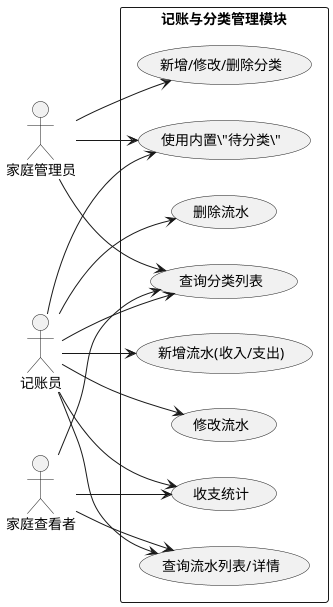
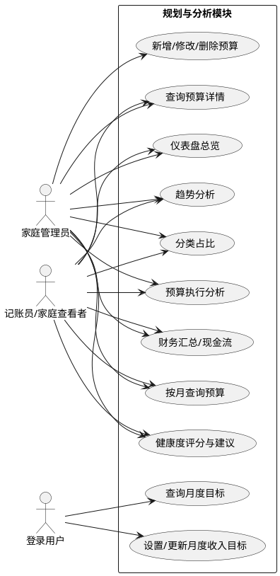
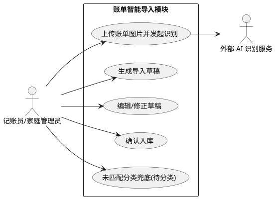

# 摘要
本系统面向个人与家庭的高频、碎片化、多终端记账需求，解决传统单机或纸本工具在协同、安全隔离与快速录入方面的不足。采用前后端分离的 B/S 架构，后端基于 Spring Boot 3.2、MyBatis、MySQL 构建 REST API，集成 Spring Security 会话认证、AOP 权限校验与 Mail / Phone 验证码服务；前端使用 Vue 3、Vite、Pinia 搭建单页应用，Chart.js 提供可视化；AI 模块通过讯飞图像理解 WebSocket API 将票据图片转为结构化流水。系统实现用户注册登录与验证码校验、昵称维护，家庭组与成员管理及分组隔离，收入/支出流水与分类管理，按月按分类的预算与已花费跟踪，月度收入目标设定，对趋势、占比、预算执行与健康度的报表分析，以及账单图片智能导入草稿后人工确认入库。在模拟家庭规模（<50 人）下平均响应低于 200ms，可满足日常高频记账与月度对账场景。

**关键词：** 记账系统；家庭组协同；Spring Boot；Vue；MySQL；AI 账单识别

# Abstract
This system addresses high-frequency, fragmented, multi-terminal accounting needs for individuals and families, closing gaps in collaboration, secure isolation, and fast entry left by legacy desktop or paper tools. It uses a separated B/S architecture: Spring Boot 3.2, MyBatis, and MySQL expose REST APIs; Spring Security handles session-based authentication; AOP enforces family-scope permissions; Mail/Phone verification supports code delivery. The frontend is a Vue 3 + Vite + Pinia SPA with Chart.js visualizations. An AI module calls the iFlytek image-understanding WebSocket API to transform bill images into structured draft records. Delivered features include user registration/login with code verification and nickname maintenance; family groups, members, and data isolation; income/expense records and categories ; monthly category budgets with spent tracking; monthly income targets; reports for trends, shares, budget execution, and health scoring; plus AI bill import that requires human confirmation before persistence. In simulated household scenarios (<50 members), average latency stays under 200 ms, meeting daily high-frequency bookkeeping and monthly reconciliation needs.

**Keywords:** accounting system; family collaboration; Spring Boot; Vue; MySQL; AI bill recognition; permission template; WebSocket OCR

# 1 引言
## 1.1 课题研究背景
在数字经济与移动互联网深度融合的时代背景下，线上支付、移动转账与电子票据的普及显著改变了个人与家庭的资金流转方式：一方面，收入来源呈现多元化趋势（如灵活就业、副业、理财收益等），另一方面，支出场景更加细碎且频繁（电商购物、订阅服务、出行消费、到店扫码等）。收支数据的“高频化、碎片化、多终端化”使财务记录不仅需要及时录入，还需要可追溯、可统计、可分析，才能支撑预算制定、消费结构优化与家庭财务决策。传统记账方式（手工记录、Excel 表格或单机软件）往往存在数据分散、统计滞后、分类口径不一致、跨设备同步困难等问题，尤其在家庭协作场景下更容易出现“多人各记各的、无法统一对账”的情况，进而影响预算控制的科学性与执行力。

与此同时，虽然市面上存在大量记账类应用，但在实际使用中仍暴露出若干共性痛点：其一，功能割裂且难以同时满足“个人 + 家庭共享”两类主体的精细化需求，缺少面向不同角色的权限控制；其二，多设备与跨平台体验不稳定，数据同步与迁移成本较高；其三，隐私与安全控制粒度不足，家庭成员间共享容易产生越权风险；其四，数据导入、对账与报表分析能力不够完善，难以形成从录入到分析的管理闭环。针对这些问题，本项目以“数据统一管理 + 家庭协作 + 智能录入”为核心目标，设计并实现一套基于 Web 的记账系统：通过 B/S 架构提供跨平台访问与集中运维能力，采用前后端分离提升迭代效率；在业务层面引入家庭组机制与角色权限模板（查看者/记账员/管理员），并以 family_group_id 实现个人与家庭数据隔离；在录入层面结合讯飞AI图像理解能力，将账单图片识别为结构化流水草稿并支持人工确认，降低录入门槛；在分析层面提供仪表盘、趋势、占比、预算执行与健康度等报表展示，帮助用户形成持续可执行的财务管理闭环。

技术选型上，后端采用 Spring Boot 构建 REST API，结合 Spring Security 会话认证与 AOP 权限校验实现身份与访问控制，使用 MyBatis 进行 SQL 映射以兼顾性能与可控性，MySQL 负责数据持久化与事务一致性；前端采用 Vue 3 + Vite 构建单页应用，并通过图表组件实现可视化分析。该课题的研究与实践顺应了互联网金融场景数字化的发展趋势，能够为个人与家庭提供低门槛、强分析、重隐私的记账工具，具有较强的现实意义与推广价值。

## 1.2 课题研究意义
本课题针对移动支付普及与消费场景碎片化带来的“收支记录高频、零散、难以复盘”问题，围绕“降低记账门槛、提升数据质量、强化协同与安全、增强分析能力”展开研究与实践，具有以下现实意义与工程价值。

（1）降低记账门槛，提升数据完整性与准确性。传统记账依赖手工录入，成本高、易遗漏且难以长期坚持。本系统在常规手动录入的基础上，引入账单图片智能导入能力：通过讯飞图像理解接口将票据/账单截图识别为结构化流水草稿，用户只需进行核对与必要修订即可入库；同时提供内置“待分类”等兜底机制，减少导入失败导致的数据缺失，从而显著降低记账门槛并提升数据质量。

（2）面向家庭场景提供协同与可控共享，贴合真实使用需求。家庭财务往往涉及共同支出、家庭预算与成员协作等情境，单人记账模式难以覆盖。本系统通过“家庭组 + 成员管理 + 角色权限模板（查看者/记账员/管理员）”实现可控共享：既支持家庭成员在同一账本中协作维护，又通过 family_group_id 的分组隔离保证个人数据与家庭数据边界清晰，减少越权与隐私泄露风险，提升家庭对账效率与透明度。

（3）形成从记录到分析的财务管理闭环，提升决策支持能力。仅有流水记录难以支撑预算制定与消费优化。本系统提供分类管理、按月按分类预算与已花费跟踪、月度收入目标设定，以及趋势、占比、预算执行与健康度等报表分析能力，帮助用户从“记账”升级为“管理账本”：可通过可视化仪表盘快速发现主要支出项与异常波动，结合预算与目标机制形成可执行的消费约束与目标达成路径，从而培养持续、理性的财务管理习惯。

（4）强化安全与隐私保护，提升用户信任。财务数据具有高度敏感性，本系统依托 Spring Security 实现会话认证与访问控制，结合验证码校验增强账户安全；通过权限注解与 AOP 校验保证家庭组范围内的访问合规；数据库层采用事务与约束保证数据一致性，并通过日志输出与异常处理提升可追溯性，为后续引入更完善的审计、脱敏展示与备份策略提供基础。

（5）具备工程化与可扩展价值，为后续能力升级奠定基础。系统采用前后端分离与分层架构（Controller/Service/Mapper/Entity），以标准化 REST API 对外提供能力，前端组件化实现快速迭代；数据库迁移脚本记录业务演进过程，便于持续交付与版本回滚。基于现有设计，可进一步扩展为支付平台账单/银行流水的标准化接入、自动分类与更精细的预算预警等能力，并为个性化推荐或更高级的隐私保护方案预留接口与工程空间。

综上，本课题不仅能为个人与家庭提供低门槛、强分析、重隐私的财务管理工具，提升财务素养与理性消费意识，也在工程实践层面验证了基于 Spring Boot 的企业级技术栈在数据管理、协同权限与智能导入场景下的可行性，具有较强的现实意义与推广价值。

## 1.3 国内外研究现状
### 1.3.1 国内研究现状
1.本土化创新与市场驱动发展
我国记账系统的研究与实践呈现出鲜明的本土化特征。早期以"随手记"、"挖财"等移动端App为代表，这些产品深刻把握了国内用户习惯，在分类体系、报表展示、社交功能等方面进行了大量本地化创新。技术架构上，这些系统普遍采用轻量级Java框架，而Spring Boot自2014年发布以来，迅速成为国内开发者的首选。其自动配置、起步依赖（Starter）、Actuator监控等特性，极大降低了企业级应用的开发门槛，特别适合项目的初步开发与实现。
国内学术文献显示，研究者们在系统功能设计上更注重实用性和完整性。伏胜洋（2022）在湖北师范大学的硕士学位论文[8]中，详细阐述了基于Spring Boot的个人记账本系统设计，涵盖了用户管理、收支记录、预算管理、财务报表等核心模块，这与任务书提出的"用户管理、收入管理、支出管理、资金计划管理"等功能清单高度吻合。该研究还探讨了使用MyBatis Plus实现数据持久化、Swagger构建API文档、ECharts进行数据可视化等具体技术实践，为本课题的技术选型提供了直接参考。
2.技术架构的深度优化研究
国内学者在Spring Boot记账系统的架构优化方面进行了大量探索。朱文杰等（2022）提出的读写分离架构[1]具有重要参考价值：通过主从复制技术将数据库读操作分流至从库，有效缓解了单点压力。在记账场景中，用户查询历史记录、生成报表等读操作占比超过80%，读写分离可显著提升系统响应速度。该研究[1]还结合了Spring AOP（面向切面编程）实现数据源动态切换，通过自定义注解标记服务层方法，透明化地完成读写路由，体现了"可维护性"的设计要求。
邱小群等（2022）在《信息与电脑》发表的研究[5]进一步指出，基于B/S架构的信息管理系统应采用分层设计，典型的Controller-Service-DAO（C-S-D）三层架构配合Spring Boot的依赖注入机制，能够实现业务逻辑与数据访问的解耦。这种架构清晰、职责明确，便于后续功能扩展和问题排查，完全符合任务书中"良好的可扩展性和可维护性"的技术要求。此外，国内外研究者[7]还普遍采用Maven进行项目构建，通过模块化拆分（如user-module、account-module）实现任务书所要求的"模块化设计"。
3.风险管理与智能化功能探索
国内研究逐渐从基础记账功能向高级财务管理延伸。吴聿晟（2021）在广西师范大学的研究《JX理财子公司产品风险管理系统研究》[3]显示，现代记账系统需整合风险评估模型，对用户的收支数据进行深度分析，识别异常交易和财务风险。例如，通过设置预算阈值触发预警，利用时间序列分析预测未来现金流等。这些功能已超出传统记账范畴，转向智能化财务顾问服务。
温腾灏等（2019）提出的"基于信息聚合的银行理财产品管理系统"[4]则揭示了另一个趋势：记账系统正成为金融服务的入口。通过聚合多银行账户信息、理财产品数据，为用户提供一站式财富管理视图。这种设计需要解决数据对接、格式统一、安全传输等问题，通常采用Spring Boot的RestTemplate或WebClient调用第三方API，结合Redis缓存热点数据，提升系统性能。

### 1.3.2 国外研究现状
1.个人财务管理软件的早期探索与技术奠基
国外个人记账系统的发展可追溯至20世纪80年代桌面软件时代，典型代表如Intuit公司1983年推出的Quicken软件，开创了电子记账的先河。这类早期系统主要基于单机架构，采用C/S（客户端/服务器）模式，数据存储在本地文件中，功能集中于基础的收支分类和报表生成。进入21世纪，随着互联网技术的普及，Mint（2006年）等在线记账平台应运而生，标志着记账系统从本地向云端迁移的重要转折。这些平台开始采用B/S（浏览器/服务器）架构，后端技术栈多为Java（Spring框架）、Python或.NET，数据库则选用MySQL、PostgreSQL等关系型数据库，为后续Spring Boot生态的兴起奠定了技术基础。
近年来，国外研究更关注系统的智能化与生态集成能力。例如，美国学者在《International Journal of Production Economics》发表的研究[7]指出，现代财务管理系统正逐步融合随机价格过程建模与金融对冲策略，将记账功能从简单的流水记录提升至资产风险管理层面（Canyakmaz et al., 2024）。这种趋势体现了记账系统与投资管理、风险评估等高级金融功能的边界模糊化，强调数据驱动的决策支持能力。技术架构上，微服务（Microservices）和容器化（Docker/Kubernetes）成为主流选择，Spring Boot因其"约定优于配置"的理念和快速开发能力，成为构建微服务节点的首选框架之一。
2.云原生与移动优先的技术转向
当前国外记账系统的技术演进呈现明显的云原生特征。研究者们普遍认同，系统应具备水平扩展能力以支持海量用户并发访问，这与任务书中"支持多用户同时在线操作，具备良好的并发性能"的要求高度契合。技术选型上，Spring Boot与Spring Cloud的组合被广泛用于构建分布式记账平台，通过Eureka实现服务注册与发现，Ribbon实现负载均衡，Hystrix实现熔断机制，确保系统高可用性。数据库层面，读写分离（Read-Write Splitting）和分库分表（Sharding）技术得到广泛应用，朱文杰等（2022）在《湖北师范大学学报》的研究[1]证实，基于Spring Boot的读写分离架构可显著提升理财系统的响应速度和数据吞吐量。
移动端适配是另一研究热点。国外学者强调，现代记账系统必须遵循"移动优先"（Mobile First）设计原则，采用响应式Web设计或独立App方案。技术实现上，Spring Boot后端通常暴露RESTful API，供前端Vue.js、React Native等框架调用，形成前后端分离架构。这种模式不仅提升了开发效率，也为后续功能扩展预留了接口空间，与任务书"模块化设计，便于功能的增加和删除"的要求一脉相承。
3.数据安全与隐私保护的强化研究
数据安全是国外文献持续关注的核心议题。随着GDPR（通用数据保护条例）等法规的实施，记账系统必须满足严格的数据加密、访问控制和审计追踪要求。技术实现上，研究者建议在Spring Boot层面集成Spring Security和JWT（JSON Web Token）实现细粒度权限管理，采用AES-256等算法对敏感财务数据加密存储，并通过数据库备份与恢复机制保障数据持久性。任务书中明确要求"具备数据备份和恢复功能，保证数据安全"，这与国际研究趋势完全一致。此外，国外学者还探讨了区块链技术在财务数据存证中的应用，通过分布式账本技术防止数据篡改，袁斌（2022）在北京邮电大学的研究[6]表明，基于区块链的供应链金融管理系统在数据不可抵赖性方面具有显著优势，该思路可为个人记账系统的安全增强提供借鉴。

## 1.4 研究目标
- 搭建基于 Spring Boot + Vue 的前后端分离记账系统，提供浏览器即可使用的统一入口。
- 支持用户认证、验证码、家庭组与权限管理，实现个人/家庭双模式与细粒度授权。
- 覆盖收入、支出、分类、预算、目标、报表等核心业务闭环，满足日常记账与月度对账需求。
- 集成讯飞AI图像理解，实现账单图片到结构化流水的自动导入，减少手工录入。
- 在典型家庭规模下保持可用性与性能，并预留可扩展的模块化架构。

# 2 相关技术
## 2.1 Java 简介
本系统后端采用 Java 17 作为主要开发语言。Java 具有跨平台特性（Write Once, Run Anywhere），可在 Windows、Linux 等环境中稳定运行；同时其强类型与完善的面向对象机制有利于对复杂业务进行建模，提升代码可读性与长期可维护性。Java 生态在 Web 开发领域积累深厚，常见的依赖管理、测试、日志、JSON 处理与网络通信等组件成熟可靠，能够降低工程实现难度。

在本项目中，Java 主要用于实现业务分层与领域模型：通过实体类表达用户、家庭组、收支流水、分类、预算、目标等核心对象；在 Service 层承载业务规则（如预算约束、家庭协作范围判断、导入数据校验等）；在 Controller 层对外提供统一的 REST 接口。与此同时，Java 的并发与网络编程能力为后续扩展提供了基础，例如通过 WebSocket 进行 AI 服务交互、通过邮件/短信通道发送验证码等。选择 Java 17 也有利于使用较新的语言特性与更高版本的 Spring Boot 生态，获得更好的性能与安全性支持。

## 2.2 Spring Boot 框架
Spring Boot 是基于 Spring 生态的快速开发框架，通过“约定优于配置”的方式显著降低项目搭建和集成成本。本项目采用 Spring Boot 3.2，主要优势体现在：

（1）快速构建 Web 服务与统一接口规范。基于 Spring MVC 的注解式开发模式可以清晰定义控制器路由、请求参数与响应结构，便于前端以 REST 方式调用；同时可结合统一异常处理与返回体封装，提升接口一致性与可维护性。

（2）完善的校验与分层协作支持。项目使用 Spring Validation 对注册、登录、收支录入、预算设置等输入进行校验（必填、范围、格式等），将数据合法性前置到接口层，减少脏数据进入数据库的概率。通过典型的 Controller–Service–Mapper 分层结构，使业务逻辑与数据访问解耦，便于功能扩展和测试定位。

（3）安全体系与会话管理。项目集成 Spring Security 实现基于会话（Session）的身份认证与访问控制，配合验证码校验增强注册/登录安全性；同时借助 AOP 切面与自定义注解，对家庭组场景下的操作进行权限校验，实现“可控共享”和“最小权限原则”，避免成员越权访问。

（4）数据访问与持久化集成。项目采用 MyBatis 作为持久层框架，并通过 Spring Boot Starter 完成自动装配；MyBatis 支持以 XML 编写 SQL，使复杂查询与统计逻辑可控且可优化，适合收支查询、报表统计、预算汇总等场景。

（5）扩展能力与系统集成。Spring Boot 生态支持 WebSocket、邮件发送等能力，本项目利用 Mail 服务发送验证码，利用 WebSocket 与外部 AI 能力进行交互；同时通过日志体系与配置化管理提升可观测性，便于问题定位与后期运维。

## 2.3 MySQL 数据库
本系统采用 MySQL 8 作为核心关系型数据库，用于存储用户信息、家庭组与成员关系、收支流水、分类、预算、目标以及权限模板等业务数据。选择 MySQL 的原因在于其成熟稳定、生态完善、成本可控，能够较好支撑中小规模 Web 应用的高频读写场景。

在数据组织方面，系统以规范化的表结构描述实体及其关系：例如用户与收支流水、分类、预算、目标之间体现“一对多”的关联；家庭组与成员体现“一对多”的组织关系；同时通过家庭组标识实现个人数据与家庭共享数据的逻辑隔离。对关键字段（如用户标识、家庭组标识、分类标识、交易日期、预算月份等）建立索引，提升常用查询（按日期范围、按分类、按家庭组/个人范围筛选）的检索效率。

在一致性与可靠性方面，系统使用 InnoDB 存储引擎，依托事务机制保障记账录入、编辑、删除等操作的原子性与一致性；通过主键、唯一约束与必要的外键/关联约束降低脏数据产生概率，保证账户、成员关系与业务记录之间的引用正确性。由于财务场景对金额精度敏感，系统对金额字段采用定点数（Decimal）存储策略，避免浮点误差累积；对时间字段区分日期与时间戳，便于按月统计、按日筛选与趋势分析。

此外，系统对部分可变权限配置采用 JSON 字段存储，能够在不频繁变更表结构的前提下表达“模块-操作”的权限矩阵（如 view/create/edit/delete），兼顾灵活性与可扩展性，为后续扩展更复杂的角色与授权规则提供数据层支持。

## 2.4 B/S 结构
B/S（Browser/Server）结构以浏览器作为主要客户端入口，由服务器集中提供业务服务与数据管理能力。本系统采用典型的 B/S 架构并结合“前后端分离”实现：

（1）跨平台与低门槛访问。用户无需安装独立客户端，通过浏览器即可访问系统，天然支持 Windows、macOS、移动端等多终端使用，降低部署与维护成本，适合个人与家庭成员的协同场景。

（2）前后端职责清晰。前端采用 Vue 3 + Vite 构建单页应用（SPA），负责页面渲染、交互逻辑、表单校验与图表展示（如分类占比、收支趋势、预算执行、健康度评分等）；后端负责提供 REST API、业务规则校验、权限控制与数据持久化。通过标准化接口协作，可以在不影响后端的前提下迭代前端体验，也便于后续扩展移动端或小程序等形态。

（3）统一认证与权限控制。B/S 结构下认证与鉴权在服务端统一实现，本系统采用基于 Session 的登录态管理，配合 Spring Security 与 AOP 权限校验，保证接口访问安全；同时以家庭组为协作边界，对个人与家庭数据进行隔离，实现“可控共享”。

（4）集中化运维与快速迭代。系统可通过统一部署后端服务并同步发布前端静态资源，实现集中运维；当业务需求变化时，可通过前后端独立迭代快速交付新功能，符合互联网应用的持续改进模式。

## 2.5 本章小结
本章围绕本项目的技术选型与实现基础进行了说明：后端以 Java 17 为语言基础，依托 Spring Boot 3.2 快速搭建 REST 服务并整合校验、安全、AOP、邮件与 WebSocket 等能力；数据层采用 MySQL 8 保障业务数据的一致性与可查询性，并通过索引与精度控制满足财务场景需求；整体采用 B/S 架构与前后端分离模式，兼顾跨端访问、协同共享与快速迭代。上述技术共同构成系统可实施、可扩展、可维护的工程基础，为后续章节的系统分析与设计提供支撑。

# 3 系统分析
## 3.1 可行性分析
为更深入地满足个人与家庭在多终端高频记账、协同共享与隐私隔离方面的需求，本节对系统建设的可行性进行分析与论证，并从技术条件、操作落地与社会实践价值等维度进行综合评估。在此基础上，进一步明确本系统在功能闭环（记账—分类—预算/目标—分析报表）与特色能力（家庭组协作权限、账单图片智能导入）方面应具备的关键需求，为后续的需求细化与总体设计提供依据。
### 3.1.1 技术可行性分析
本系统在技术上具备良好可行性：后端采用 Spring Boot、MyBatis、Spring Security，并集成 Mail 与 WebSocket 等成熟组件，依托 Java 17 的长期支持保证稳定性与可维护性，整体虽为单体架构但按模块分层设计便于后续拆分与扩展；前端基于 Vue 3、Vite、Pinia 与 Chart.js 等成熟生态，能够高效构建交互性强的表单与数据报表界面；账单智能导入方面，讯飞AI图像理解 API 通过 WebSocket 提供稳定的图片识别能力，可快速实现账单智能导入。

### 3.1.2 操作可行性分析
### 3.1.2 操作可行性分析
系统以 Web 为主要交付形态，用户无需安装客户端即可在多终端（桌面浏览器与移动浏览器）上使用，结合前端路由与模块化页面设计，能够以较小的推广成本覆盖个人与家庭用户。页面与接口均实现基本表单校验、重复提交防护与友好提示，配合内置分类与预算模板可降低新用户的学习门槛；在运维层面，单体部署 + 前端静态资源随后端发布的方式便于集中管理，AI 识别等外部能力通过稳定的 WebSocket/HTTP 接口集成，能够在现有基础设施下平滑接入与扩展。

### 3.1.3 社会可行性
从社会与用户需求角度，本系统契合家庭记账提升透明度、预算管理与协同记账的现实诉求，提供的分组隔离与角色权限机制有助于降低家庭成员间的越权风险并提升对账效率；账单智能导入与可视化报表能够显著降低记账门槛并提升数据质量，具备较强的用户采纳潜力。综上，该系统在满足隐私保护、易用性与实用性方面具备良好社会推广价值，适合在小规模家庭场景先行试点并逐步推广。

## 3.2 需求分析
本系统的总体需求可概括为对个人与家庭两类使用场景提供一套可用、可控且易用的记账服务：用户层面需支持基于手机号/邮箱的验证码注册登录、会话管理与基本资料维护；多用户协作层面需支持家庭组的创建/加入、成员管理与基于角色的权限模板，以 family_group_id 实现个人与家庭数据的逻辑隔离；业务功能层面需覆盖收入/支出流水的新增/查询/修改/删除、收入与支出分类的管理、按分类与月份的预算设置与执行跟踪、以及月度收入目标设定与完成度查询；分析层面需提供仪表盘、趋势与分类占比、预算执行与健康度等报表，为决策提供可视化支持；导入层面需支持账单图片上传并调用外部 AI 服务生成可编辑的导入草稿，人工确认后入库，未命中分类时落入“待分类”兜底；接口与前端要求前后端分离、RESTful API 设计与单页应用（SPA）支持，以便多终端访问与扩展；非功能需求包括事务一致性与金额精度保证、响应延迟控制（通常目标 <200ms 在小规模家庭场景下）、会话与权限的安全校验、输入校验与防刷机制、以及良好的可扩展性与可运维性（分层架构、日志与迁移机制）。

### 3.2.1 用户与账户模块（认证 + 验证码 + 资料）
参与者：游客/未登录用户、登录用户、验证码发送服务（邮件/短信）。

主要用例：
- 发送验证码/校验验证码：用于注册与关键操作的身份确认。
- 用户注册/用户登录/用户退出：建立与销毁会话（Session）。
- 获取当前用户/查看资料/修改昵称：用于前端初始化登录态与展示成员身份。

用例图（用户与账户模块）：

### 3.2.2 家庭协作与权限模块（家庭组 + 成员 + 角色模板）
参与者：登录用户、家庭管理员、家庭成员。

主要用例：
- 创建家庭组/获取家庭码/通过家庭码查询家庭：建立家庭协作空间与邀请通道。
- 加入家庭组/退出家庭组：成员加入与退出协作空间。
- 查看成员列表：用于协作透明与权限配置。
- 分配权限：管理员为成员分配具体权限。
- 移除成员：管理员移除不再参与的成员。

用例图（家庭协作与权限模块）：

### 3.2.3 记账与分类管理模块（收支流水 + 分类）
参与者：家庭管理员及有权限的用户。

主要用例：
- 新增/修改/删除流水：对收入与支出记录进行维护，保证数据可追溯与可统计。
- 查询流水列表/详情：支持按日期范围、分类、个人/家庭范围筛选。
- 收支统计：为仪表盘与报表提供基础聚合数据。
- 分类管理：维护收入分类/支出分类口径，支撑统一统计（内置“待分类”用于兜底）。

用例图（记账与分类管理模块）：

### 3.2.4 规划与分析模块（预算 + 目标 + 报表 + 健康度）
参与者：家庭管理员、记账员/家庭查看者、登录用户。

主要用例：
- 预算管理：按月/按分类新增、修改、删除预算，查询预算执行情况。
- 目标管理：设置/更新月度收入目标，查询目标与完成度入口。
- 报表分析：提供仪表盘总览、趋势分析、分类占比、财务汇总/现金流等展示能力。
- 预算执行与健康度：对比预算与实际支出，输出健康度评分与建议入口。

用例图（规划与分析模块）：

### 3.2.5 账单智能导入模块（AI 识别 + 草稿确认入库）
参与者：记账员/家庭管理员、外部 AI 识别服务。

主要用例：
- 上传账单图片并发起识别：调用外部 AI 服务获取识别结果。
- 生成导入草稿/编辑修正：将识别结果转换为可编辑草稿并人工校对。
- 确认入库：将草稿转为正式流水并持久化。
- 未匹配分类兜底：未命中分类时落入“待分类”。

用例图（账单智能导入模块）：

## 3.3 非功能需求分析
- 性能：常规查询/录入响应目标 <200ms；家庭小规模并发下保持稳定。
- 安全：会话认证 + 权限注解 + AOP 校验；family_group_id 分组隔离；验证码防刷；密码加密存储。
- 可用性：前端路由守卫、表单校验、错误提示；移动端友好布局；内置分类与默认模板降低学习成本。
- 可扩展性：Controller/Service/Mapper/Entity 分层，SQL 迁移脚本支撑表演进；AI 接口可替换；WebSocket 预留实时通知。
- 可靠性：MySQL 事务保证一致性；日志级别可调；异常统一处理便于排障。

## 3.4 本章小结
本章围绕本记账系统的实用性与预期功能进行了系统化分析：在分别从技术条件、操作落地与社会价值等维度完成可行性论证的基础上，进一步明确了系统建设目标与基本原则，确保“个人/家庭双模式、协同共享可控、数据隔离安全、录入高效便捷、分析可视化闭环”等关键诉求可被后续设计与实现准确承接。随后，章节以项目实际功能域为依据，对用户认证与验证码、家庭组协作与权限、收支流水与分类管理、预算/目标与报表分析、以及账单图片智能导入等核心模块进行了需求梳理，并通过用例图刻画参与者与操作边界，为后续权限边界、数据范围与接口设计提供清晰的需求依据与验收参照。

# 4 系统设计
## 4.1 系统总体结构设计
- 架构：前端 Vue SPA（Vite 构建）部署在后端静态目录；后端 Spring Boot 提供 REST API；MySQL 持久化；MyBatis XML Mapper 访问数据库；Spring Security 负责认证与鉴权；AOP 切面实现家庭权限注解。
- 集成：讯飞图像理解通过 WebSocket 调用；Spring Mail 发送验证码；日志分级输出；会话基于 Spring Session（内存存储，可扩展为 Redis）。
- 部署：单体可容器化部署，前端静态资源随后端发布，便于一体化运维。

## 4.2 系统功能结构设计
- 用户与认证：注册、登录、验证码、昵称维护、密码加密、会话与权限校验。
- 家庭组协作：家庭组创建/加入，成员管理，权限模板分配，家庭/个人双模式数据隔离。
- 收支与分类：收入/支出流水 CRUD，按日期/分类/家庭组过滤；分类（内置 + 自定义）管理。
- 预算与目标：按月分类预算，记录已花费；月度收入目标与完成度对比。
- 报表与分析：仪表盘、趋势、分类占比、预算执行、健康度评分。
- AI 账单导入：图片上传与识别、草稿确认后入账，未匹配分类落入“待分类”。

### 4.2.1 家庭协同记账功能
- 家庭组：唯一 code，名称与描述；创建者唯一约束保证每用户仅一个家庭组。
- 成员与角色：family_member 记录成员与角色；角色对应权限模板（查看者/记账员/管理员），权限以 JSON 存储。
- 分组隔离：family_group_id=0 表示个人数据，非 0 表示家庭数据；拦截器/切面按注解校验访问权限。

### 4.2.2 收支与预算分析功能
- 流水管理：income/expense 记录金额、分类、日期、描述；索引支持按日期与分类查询。
- 分类管理：income_category/expense_category 支持内置与自定义；“待分类”用于 AI 导入未匹配场景。
- 预算与目标：budget 以 user/family + category + month 唯一；user_target 记录月度收入目标；对比生成执行度。
- 报表分析：结合前端 Chart.js 展示分类占比、趋势、预算对比、健康度评分；支持家庭/个人切换。
- AI 导入：图片调用讯飞 API 返回结构化草稿，用户确认后入库。

## 4.3 数据库设计
### 4.3.1 数据库概念结构设计
核心实体与关系：
- 用户（user）1..N 收入/支出/预算/目标；1..1 创建家庭组；1..N 家庭成员记录。
- 家庭组（family_group）1..N 家庭成员（family_member）；family_group_id 关联收支、分类、预算实现分组隔离。
- 分类（income_category、expense_category）与收支（income、expense）为 1..N 关系。
- 预算（budget）关联用户/家庭组与分类；目标（user_target）关联用户与月份。
- 权限模板（permission_template）供成员角色引用（JSON 权限定义）。
- 验证码（verification_code）与注册/找回流程关联；tax_record/tax_rule 预留税务扩展。

### 4.3.2 数据库物理结构设计
主要表（字段择要）：
- user：id, username, nickname, password, phone, email, status, create_time, update_time。
- verification_code：email/phone, code, type, ttl, is_used, created_time。
- income/expense：user_id, family_group_id, category_id, amount, transaction_date, description, create_time, update_time。
- income_category/expense_category：user_id, family_group_id, name, description, is_built_in, create_time, update_time。
- budget：user_id, family_group_id, category_id, budget_month, amount, spent, remark, create_time, update_time。
- family_group：code, name, description, creator_id, status, create_time, update_time。
- family_member：family_group_id, user_id, role, permissions(JSON), join_time, status, create_time, update_time。
- permission_template：name, description, permissions(JSON), built_in, create_time, update_time。
- user_target：user_id, target_month, income_target, create_time, update_time。
- tax_record/tax_rule：税种、税率、区间、状态及时间字段，支持扩展税务场景。

索引与约束：
- 用户名/邮箱/手机号唯一；budget 以 user/family + category + month 唯一；family_group_id、transaction_date、category_id 建立索引支撑常用查询；外键约束家庭组与成员；permissions 以 JSON 存储灵活扩展。

## 4.4 本章小结
本章阐述了总体架构、功能结构与数据库设计。family_group_id 的分组设计与权限模板保证了个人/家庭双模式的数据隔离和授权；前端 Vue 与后端 Spring Boot 协同提供一致的交互与性能基础，为后续实现与测试奠定框架。

# 5 致谢
毕业设计写到这里，心里其实挺踏实也挺感慨的：从最开始觉得“做个能用的系统就行”，到后面为了一个接口返回格式、一次权限校验、一个统计口径反复推敲，才发现把东西做“跑得起来”和“用得起来”完全是两回事。能顺利把这套面向个人与家庭的记账系统做出来，并把文档写完整，离不开很多人的帮助。

首先要特别感谢我的毕业设计指导老师邓依依老师。老师在选题、需求边界、论文结构和细节把控上给了我非常具体、非常“落地”的指导：哪里写得空、哪里描述不严谨、哪里功能表述与实现对不上，都会被老师一针见血地点出来。我有时候写着写着会飘，或者代码实现上图省事，老师的反馈让我及时把思路拉回到“工程能落地、论文能自洽”的轨道上。感谢老师在我卡壳的时候愿意多问一句、多看一眼，也感谢老师在写作表达上一直耐心指导我：不求华丽，但要把逻辑讲清楚、把论据写扎实。

其次感谢在项目过程中给过我建议和帮助的同学们。无论是帮我一起对需求、一起测一测家庭协作的边界，还是在我熬夜改 Bug 的时候顺手丢一句“你这个可能是权限没带上”，这些看似随意的提醒都很关键。也要感谢在课程与实验中积累的基础，让我在 Spring Boot、数据库设计、前后端分离这些点上不至于从零开始摸索。

还要感谢我的家人。做毕业设计这段时间，情绪起伏其实不小：有顺风顺水的时候，也有卡了好几天却找不到原因的时候。家人给我的支持很朴素——不催、不打断，给我留出完整的时间把事情做完，这对我来说很重要。

最后感谢开源社区和工具生态。站在 2026 年这个时间点，开发效率的提升离不开成熟框架、组件库以及各类自动化与 AI 辅助工具的支持，它们帮我更快地定位问题、优化代码结构、打磨交互细节。但我也更清楚：工具只能加速，质量和责任还是得落在自己身上。通过这次毕业设计，我最大的收获不是“做了多少功能”，而是学会了在真实约束下把需求拆清、把边界守住、把系统做稳。

再次感谢邓依依老师以及所有帮助过我的人。愿自己以后写的代码更少返工、文档更少废话、做事更有章法。

# 6 结论
本课题面向个人与家庭在“高频、碎片化、多终端”场景下的记账需求，围绕协同共享、安全隔离与快速录入等关键痛点，设计并实现了一套基于 B/S 架构的记账系统。系统采用前后端分离的实现方式：后端以 Spring Boot 3.2 为核心构建 REST API，结合 MyBatis 与 MySQL 完成数据持久化与统计查询；通过会话认证与权限校验机制保障访问安全与家庭范围内的数据边界；前端基于 Vue 3 + Vite + Pinia 构建单页应用，完成多页面业务流程与可视化展示；同时引入外部 AI 图像理解能力，将账单图片转换为结构化导入草稿并支持人工确认入库，从而降低录入成本、提升数据完整性。

## 6.1 主要工作与成果
（1）完成面向个人/家庭双模式的数据建模与业务闭环设计。以 family_group_id 为协作边界，支持个人账本与家庭账本的逻辑隔离，并覆盖用户认证与资料维护、家庭组与成员管理、收支流水与分类管理、预算与目标、以及报表分析等核心功能。

（2）实现可控共享与权限边界。通过角色与权限模板的思路，对不同成员的查看、记账与管理能力进行约束，使协作场景下的数据访问具备明确边界，降低越权风险。

（3）提供面向日常使用的统计分析与可视化呈现。系统围绕趋势、占比、预算执行与健康度等维度输出报表，并在前端以图表方式展示，帮助用户从“记录流水”过渡到“发现问题、调整预算与习惯”。

（4）引入账单图片智能导入能力。通过外部 AI 识别服务将图片解析为结构化草稿，并提供可编辑与确认入库流程，配合“待分类”等兜底策略，兼顾效率与准确性。

## 6.2 不足与改进方向
尽管系统已经形成较完整的功能闭环，但仍存在进一步优化空间：其一，系统目前以单体部署为主，面对更高并发与更复杂的家庭协作场景时仍需要更完善的缓存、异步化与扩展方案；其二，AI 导入对外部服务存在依赖，识别结果在类别匹配与口径统一方面仍需要更多自动化与可解释的校正策略；其三，数据运维层面仍可补强，例如更完善的数据导出/备份恢复、审计追踪与异常告警机制；其四，交互体验仍可持续打磨，包括移动端适配、表单容错、批量操作与更细粒度的统计筛选等。

## 6.3 未来展望
后续工作可在保持现有架构清晰度的前提下，逐步引入会话与热点数据的集中化缓存、异步任务队列与更精细的权限策略；在导入侧探索自动分类、规则/模型结合的类别推荐与更高质量的对账流程；在数据侧完善导出、备份与隐私保护机制，提升系统可运维性与用户信任。总体而言，本系统已验证了基于 Spring Boot 与 Vue 技术栈在“家庭协作记账 + 数据隔离 + 智能导入 + 可视化分析”场景下的可行性，为后续功能演进与工程化部署提供了可靠基础。

# 7 系统测试
系统测试是软件工程中连接“功能实现”与“实际可用”的关键环节。本项目以 Web 记账系统为载体，综合考虑个人/家庭双模式、权限隔离、数据统计与 AI 导入等业务特性，采用以黑盒测试为主的方法，对核心业务流程与关键边界进行验证，确保系统在典型使用场景下具备稳定可用的交付质量。

## 7.1 系统测试目的
（1）验证系统功能是否满足需求。重点覆盖用户注册登录、家庭组协作与权限控制、收支与分类管理、预算/目标与报表分析、账单图片导入等主流程。

（2）发现并定位影响使用的缺陷。通过典型场景与异常输入组合，尽早暴露接口校验、权限边界、统计口径与前端交互流程中的问题。

（3）评估系统的可用性与稳定性。关注高频操作（新增流水、查询列表、切换家庭/个人范围等）在常见终端与网络条件下的响应表现与错误提示。

（4）为验收与后续迭代提供依据。将测试用例沉淀为可重复执行的验证清单，便于回归测试与功能扩展后的质量控制。

## 7.2 系统测试方法
本项目主要采用黑盒测试（Black-box Testing），即从用户视角出发，将系统视为“输入—输出”的黑盒，通过界面操作与接口调用验证功能行为是否符合预期，而不依赖内部代码结构。考虑到记账系统业务规则较多、边界条件明显，本章测试用例设计综合采用以下黑盒策略：

（1）等价类划分。将输入域划分为有效等价类与无效等价类，例如验证码长度/格式、金额字段范围、日期字段合法性等。

（2）边界值分析。重点覆盖金额为 0、极小值/极大值、月份切换边界、预算金额临界点（刚好等于/略超预算）等。

（3）场景法（基于用例流程）。围绕“注册→登录→创建家庭→成员加入→分配角色→记账→预算→报表”的端到端链路验证系统协同与数据一致性。

（4）判定表/权限矩阵法（针对权限）。对“管理员/记账员/查看者”在不同模块的可执行操作进行组合验证，确保权限控制与提示行为一致。

### 7.2.1 测试环境与工具
测试环境以开发联调环境为主，覆盖常见的浏览器访问与接口调用方式：
- 客户端：Windows 10/11 + Chrome/Edge 浏览器；
- 服务端：JDK 17 + Spring Boot 3.2；
- 数据库：MySQL 8；
- 工具：浏览器开发者工具（Network/Console）、Postman 或 Apifox（用于接口请求与 Cookie/Session 验证）。

### 7.2.2 测试范围与原则
- 覆盖范围：功能正确性优先，其次关注权限隔离、输入校验、错误提示与关键统计口径；
- 不在本章重点：深度性能压测与安全渗透测试（可作为后续工作扩展），但会对高频接口做基础的响应观察与异常回放；
- 回归策略：当数据库结构、权限规则、统计口径或导入流程发生调整时，优先回归 7.3 中的主链路用例。

## 7.3 测试用例
为保证覆盖核心能力，测试用例按“认证与会话、家庭协作与权限、记账与统计、AI 导入”四类组织。表中“步骤”以用户视角描述，便于后续按清单重复执行。

| 用例编号 | 测试项 | 前置条件 | 测试步骤 | 期望结果 |
| --- | --- | --- | --- | --- |
| TC-01 | 发送验证码（邮箱/手机） | 未登录 | 输入合法邮箱/手机号→点击发送验证码 | 接口返回成功；发送频率受限；提示信息明确 |
| TC-02 | 注册（验证码正确） | 已获取验证码 | 输入账号信息+正确验证码→提交注册 | 注册成功；可登录；密码加密存储（对用户侧表现为不可见） |
| TC-03 | 登录与会话保持 | 已注册用户 | 输入正确账号密码→登录→刷新页面 | 登录成功；会话保持；前端能获取当前用户信息 |
| TC-04 | 登录失败（错误密码/账号） | 已注册用户 | 输入错误密码→登录 | 登录失败；提示不泄露敏感信息；不会建立会话 |
| TC-05 | 创建家庭组并获取家庭码 | 已登录 | 进入家庭管理→创建家庭组→查看家庭码 | 创建成功；家庭码生成；后续可用于加入 |
| TC-06 | 通过家庭码加入家庭 | 账号 B 已登录；账号 A 已创建家庭组 | B 输入家庭码→申请/加入 | 加入成功；成员列表可见；数据范围切换为家庭 |
| TC-07 | 权限验证：查看者禁止新增流水 | 已存在家庭；B 角色为查看者 | B 尝试新增支出/收入流水 | 被拒绝或按钮不可用；给出明确提示；数据未写入 |
| TC-08 | 新增支出流水并查询 | 记账员/管理员已登录 | 新增支出（金额、日期、分类）→查询列表→查看详情 | 新增成功；列表与详情一致；金额与日期显示正确 |
| TC-09 | 分类管理（新增/修改/删除） | 管理员已登录 | 新增分类→修改名称→删除分类 | 变更生效；被引用分类受约束或给出提示；列表更新 |
| TC-10 | 预算设置与执行跟踪 | 已存在分类与流水 | 设置某月某分类预算→新增对应支出 | 预算保存成功；已花费随流水变化；执行率计算正确 |
| TC-11 | 月度收入目标设置与查询 | 登录用户 | 设置某月收入目标→进入目标/仪表盘查看 | 目标保存成功；展示完成度入口或对比数据 |
| TC-12 | 报表统计（趋势/占比/汇总） | 存在多条收支流水 | 进入报表/仪表盘→选择时间范围→查看图表 | 图表正常渲染；统计口径与筛选条件一致；无异常报错 |
| TC-13 | AI 账单导入草稿→确认入库 | 记账员/管理员已登录 | 上传图片→发起识别→编辑草稿→确认入库 | 生成草稿；可编辑；确认后转为正式流水；未匹配分类落入“待分类” |
| TC-14 | 退出登录与鉴权失效 | 已登录 | 点击退出→访问需登录页面/接口 | 退出成功；受保护资源被拦截并引导重新登录 |

## 7.4 测试总结
本次系统测试按照 7.3 所列用例（TC-01～TC-14）进行执行，覆盖注册/登录与会话、家庭组加入与角色权限、流水与分类管理、预算与报表统计、以及账单图片导入“草稿—确认入库”等关键流程。执行结果汇总如下。

| 统计项 | 数量 |
| --- | --- |
| 用例总数 | 14 |
| 通过 | 14 |
| 未通过 | 0 |
| 阻塞 | 0 |

在测试过程中，重点对以下内容进行了结果核对：
（1）鉴权与会话：登录后页面刷新/跳转仍保持会话；退出登录后访问受保护资源会被正确拦截并提示重新登录。

（2）数据范围与权限边界：个人与家庭范围切换后，列表、统计与新增操作的作用域一致；不同角色（管理员/记账员/查看者）在关键操作上的“可见/可操作/被拒绝提示”行为符合预期。

（3）关键业务一致性：新增/编辑流水后，列表、详情与报表统计口径保持一致；预算执行与目标完成度在临界情况下（例如“刚好等于预算”“略超预算”）展示正确。

（4）导入流程可控性：账单识别结果以草稿形式呈现，允许用户在入库前修正金额、日期、分类等字段；未能自动匹配的分类可落入待处理状态，避免“错误自动入账”。

需要说明的是，本次测试以功能正确性与权限边界验证为主，未进行大规模并发压力测试与渗透级安全测试。后续若面向真实部署场景，建议补充：高频接口的并发压测（列表查询/新增流水/统计接口）、异常网络条件下的容错测试（超时/重试/幂等）、以及更系统的安全基线检查（会话安全、越权访问、输入过滤与日志审计）。

## 7.5 本章小结
本章给出了系统测试的目标、黑盒测试方法与用例设计，并针对记账系统的典型风险点提出了回归策略与关注重点。通过将测试用例清单化、可重复化，可为系统验收与后续版本演进提供稳定的质量保障依据。
